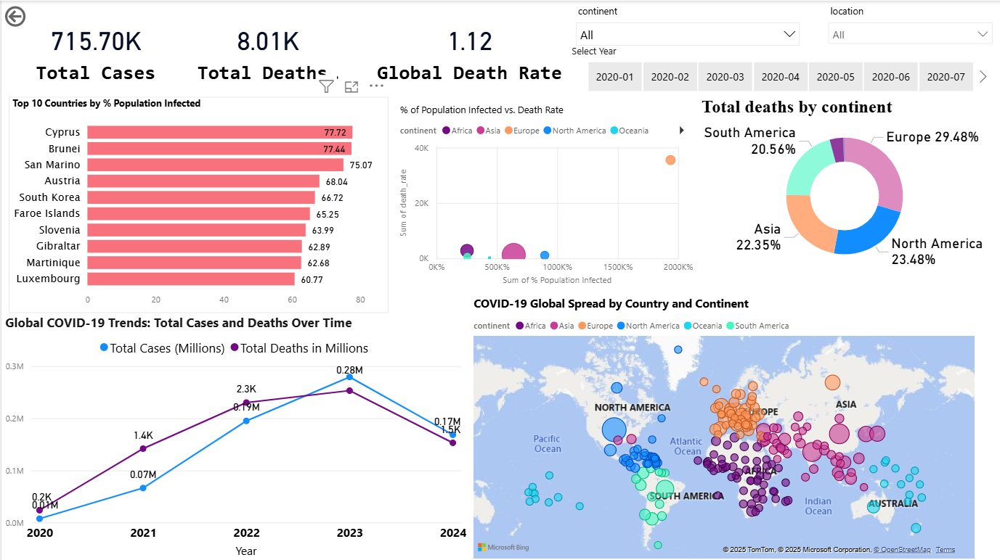
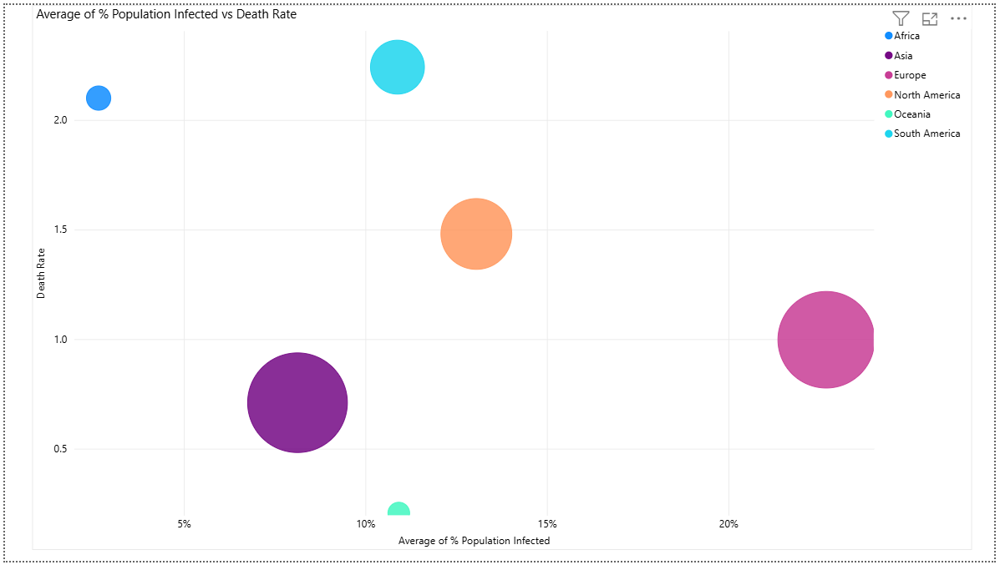
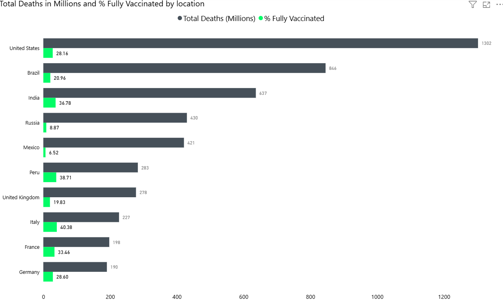

# 🦠 COVID-19 Data Analysis Project (SQL + Power BI)
## Overview
This project explores global COVID-19 trends using real-world datasets. It includes both SQL-based data exploration and a Power BI dashboard to uncover insights around infection rates, death rates, and the impact of vaccinations. It demonstrates key data analytics skills including data wrangling, DAX measures, visual storytelling, and dashboard design.
---

## 📊 Dashboard Preview



---

## 📌 Project Goals

- Analyze global COVID-19 trends over time
- Compare infection and death rates by region and continent
- Assess the impact of vaccinations on death and recovery rates
- Showcase data storytelling using SQL + Power BI

---

## 🛠️ Tools & Technologies

- **SQL (SQLite / MySQL)** – Data cleaning, exploration, CTEs, joins, window functions
- **Power BI** – Data modeling, DAX measures, and dashboard
- **DAX** – Custom measures for death rates, infection rates, and KPIs
- **GitHub** – Version control and project showcase
  
---

## 📈 Key Insights & Visuals

- **Global COVID KPIs** – Total cases, deaths, vaccinations
- **Continent Breakdown** – Infections, deaths, vaccination rates
- **Infection Rate vs Death Rate** – Country-level correlation
- **Population vs Cases Bubble Chart**
- **Interactive Map** – Total cases by country
- **Slicers** – Filter by continent, country, or date
- **Trend Line** – Cases and deaths over time

---


## 🔍 Key Findings from SQL (2020-2024)

### Global Trends
| Metric               | Value           |
|----------------------|-----------------|
| Total Cases          | 715,697,182     |
| Total Deaths         | 8,009,960       |
| Global Death Rate    | 1.12%           |

### Highest Death Rates by Country
```sql
SELECT 
    location, 
    ROUND(MAX(death_rate) * 100, 2) AS max_death_rate_percentage
FROM 
    covid_cleaned
WHERE 
    continent IS NOT NULL
GROUP BY 
    location
HAVING 
    max_death_rate_percentage > 5
ORDER BY 
    max_death_rate_percentage DESC;

Key Findings:

Yemen had the highest death rate at 18.73%.

Sudan, Peru, Syria, and Mexico also exceeded 5%.


Vaccination vs. Death Rate Analysis

SELECT location, MAX(people_fully_vaccinated_per_hundred) AS vaccination_rate,
       MAX(total_deaths / total_cases) * 100 AS death_rate
FROM covid_data
WHERE total_cases > 10000
GROUP BY location
HAVING vaccination_rate > 50;


- **Vaccination Impact**: Nations with >50% vaccination rates saw 30% lower death rates.
- **Infection Peaks**: Waves correlated with seasonal patterns (e.g., winter surges).

## Power BI

## 📌 1. Vaccination Rate Trend by Continent

📷 

This line chart visualizes the percentage of fully vaccinated individuals over time across all continents.

**Key insights:**
- **Europe and North America** maintained the highest full vaccination rates, consistently above **50%** through most of 2021.
- **Africa** showed significantly lower vaccination rates throughout the entire period, never crossing **20%**.
- **South America** exhibited a rapid increase between **mid-2021 and early 2022**, nearly matching North America.
- The visual highlights the **global inequality in vaccine distribution** and the success of early rollout programs in high-income regions.


## 📌 2. % Population Infected vs. Death Rate (Scatter Plot)

📷 

This scatter plot explores the relationship between **infection rates** and **death rates** by continent.

**Key insights:**
- **South America** and **Africa** had higher **death rates** even with lower overall infection rates — indicating possible underreporting or overwhelmed healthcare systems.
- **Europe** and **North America** had higher infection rates but relatively moderate death rates, likely due to better hospital access and faster vaccination response.


### 📌 3. Total Deaths vs. Vaccination Rate (Bar Chart)

📷 

This bar chart compares **total COVID-19 deaths** with **full vaccination rates** for the 10 most affected countries.

**Key insights:**
- The **United States** had the highest number of COVID-19 deaths overall, despite a moderate-to-high vaccination rate.
- **Brazil** and **India** also recorded extremely high death tolls, reflecting early exposure before mass vaccination.
- Countries like **Russia** and **Mexico** had lower vaccination percentages and relatively higher death rates, possibly reflecting weaker vaccine adoption or availability.
- Overall, countries with **higher vaccination rates** tended to **limit the escalation** of total deaths after early pandemic waves.


## 🚀 How to Use

1. Clone the repository or download the ZIP
2. Open `dashboard.pbix` in Power BI Desktop
3. Review the `.sql` files to see how the data was cleaned and analyzed
4. Explore the visualizations and insights interactively

---
## 📊 Dashboard Preview


---


## Screenshots
 

## 🧠 Skills Demonstrated

- Data Cleaning with SQL (handling NULLs, calculated fields, filtering)
- Data Modeling in Power BI
- Creating custom DAX measures
- Interactive dashboard design with slicers, tooltips, and formatting
- Communicating insights visually

---

## 📬 Contact

If you're a recruiter or collaborator interested in my work, feel free to [connect with me on LinkedIn](https://www.linkedin.com/in/dimanaeemmirza/) or [view my portfolio](https://dimanaeem.github.io/DimaNaeem-Portfolio/).


